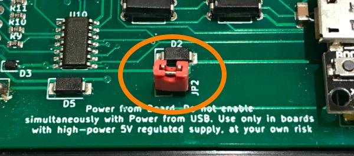

# Elfacun Chess Interface Module

## Brocoli Power Module

The Brocoli power module allows you to operate Elfacun wirelessly and in some situations operate the board with the drawer closed. It can work with V1 and V2 modules plus with most original 5V Mephisto modules. Brocoli gets its power from a user-provided standard USB power bank.

## Features

The module features are:

* Gets power from a standard USB power bank
* Gives 5V stabilized supply direct to the board and modules
* Provides up to 6W of power (1.2 amps at 5 volts)
* Gives 1.6KV isolation between the USB power bank and the board power rails
* Overcurrent protection for the USB power bank
* Short-circuit protection for the USB power bank
* On-off switch
* On led indicator

## Choosing a suitable power bank

Brocoli is provided without a power bank, the user has to provide his own.

The main limitation for choosing a power bank is that it has to fit inside the Brocoli module. The maximum dimensions for the bank are:

* Width: 68mm
* Depth: 106mm
* Height: 16mm

If the power bank exceeds any of these dimensions it may not fit inside Brocoli, or Brocoli may not fit inside the board.

Most 5.000Mah power banks will fit on these dimensions, but check always anyway. Most 10.000Mah power banks won0t fix except for a few that will be a tight fit.

The power bank has to provide a USB-A connector. Also it is better if the bank has the A-type connector sided, as showed on this photo

If the connector is centered it may work anyway but you may have to cut a zip tie on the back of the module to be able to get more play for the cable. The USB cable on the module is not detachable.

The power bank has to be able to provide at least 2 amps at full load (10W). If you are using only Elfacun 1 amp is enough but you won't be able to power the more power-hungry original modules with that, just Elfacun.

It is better if the power bank is of the type where you don't need to push a button to start it. That way you can just use the power button on the Brocoli module to control the power bank.

It is also a desirable feature that the power bank does not swith off with small loads. Some power banks switch them off if they don't detect a high load from a charging device like a phone.

## Tested power banks

These are the power banks that are tested to work.

* Posugear 10.000Mah. Only the kind that has 4 leds forming a square to indicate the charge level. This one has two power connectors on the sides. The center C connector is for charging only

* VEGER 10.000Mah, but this has the USB connector in the center so it is not ideal but it will work.

## Battery life.

With a 10.000 Mah power bank you can expect 24 hours of continous operation with Elfacun on the default screen brightness configuration, and 12 hours in Lichess mode.

In theory using the USB cable connection to the module you can switch "live" the power bank without a need to switch the module off.

## Instructions

Do not use the power module and power from the board at the same time.

If you are using Brocoli with a high-power original module it is not recommended to close the board drawer to improve cooling. That is recommended anyways with any original module that has vent holes on its case, with or without Brocoli.

## Using Brocoli with V2 modules

To use Brocoli with Elfacun V2 just make sure the front jumper is installed to enable power from the board.

## Using Brocoli with V1 modules

To use Brocoli with Elfacun V1 the power from the board jumper is on the back side so you have to open the module to install it.

First you need to open the module lid, very carefully beginning on one corner and opening first a complete side and then the other, as the 3D-printed poles are not as sturdy as on the original modules.

Then unscrew the two screws that hold the PCB to the upper case and separate the PCB from the case.

Now you can install a jumper in the pins labelled as "power from the board"

Be warned that if you want to use later a 6V original module with "power from the board" you may have to open the module again to remove the jumper.

## Using Brocoli with original modules

Brocoli has been tested to work with most 5V original modules. Currently the only untested modules that can suppose a problem are RISC and RISC 2.0. Do not use brocoli with 6V modules unless you modifiy the module to remove the diode that drops the input voltage.

_"DGT", "Millennium" and "Mephisto" are trademarks of their respective owners.
All the trademarks are used nominatively to indicate compatibility, and do not indicate affiliation to or endorsement by the trademark owners._
