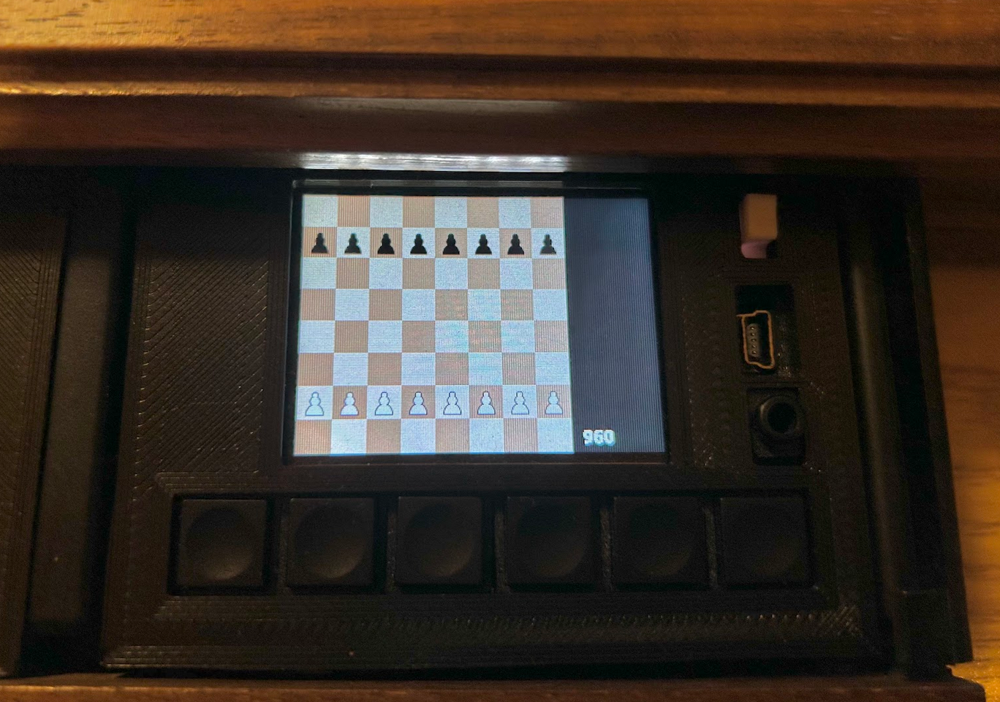

# Elfacun Chess Interface Module

## Compatibility

### Tested apps

Link to the updated compatibility list:

https://docs.google.com/spreadsheets/d/12Uv9kzwfK2hOjxCerdxXKaBquyXnUyqvHLZR6gPWI9A/edit?usp=sharing

I will give now detailed reports of the known apps not being 100% compatible and the reasons for that.

### ChessLink (IOS, Android)

The LED lights are not operational as they are shown with a big delay for unknown reasons. Until solved, it is recommmended to disable the LEDs if you are going to use the module with this app. That can be done by default with SD-card configuration, or temporarily booting the module with its fifth button pressed.

### HIARCS (Windows)

HIARCS on Windows does not provide a configuration option to indicate a serial port for the connected board, and fails to detect Elfacun for unknown reasons, so it cannot be used. That only applies to the Windows desktop version, the mobile version works fine via Bluetooth. MacOS version may or may not work as it has not been tested.

### ARENA (Windows)

The clock data doesn't work well with Arena with Elfacun in DGT mode.

### Picochess

Picochess works fine with Elfacun but you will have to force the Revelation-II mode with a small code modification if you want to have LED support enabled.

[Using Elfacun with Picochess](MANUAL.md#Using-Elfacun-with-Picochess)

### Chess.com (Android)

Chess.com app is weird, because it apparently only allows to use the board in rated games against random opponents, so it makes testing almost impossible and currently doesn't seem to work at all. If they change this behaviour in the future I will look again into it.

### Rabbitplugin (Windows)

Some apps like Shredder Classic don't work at all interfacing Elfacun with Rabbitplugin, but work fine with the replacement Graham O'Neill DGT or Millennium drivers. You can get them here:

https://goneill.co.nz/chess.php

_"DGT", "Millennium" and "Mephisto" are trademarks of their respective owners.
All the trademarks are used nominatively to indicate compatibility, and do not indicate affiliation to or endorsement by the trademark owners._
