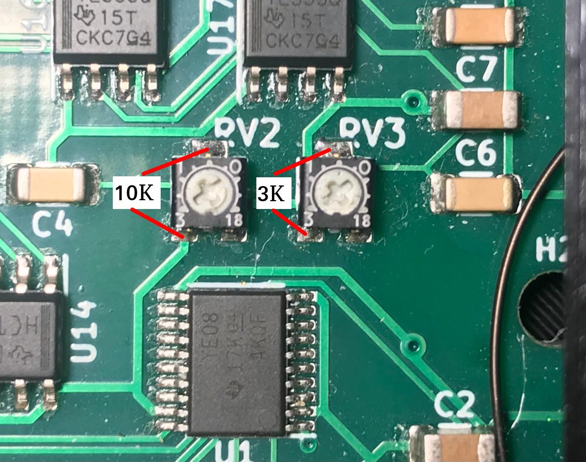

# Elfacun Chess Interface Module

## Compatibility

### Tested apps

Link to the updated compatibility list:

[https://docs.google.com/spreadsheets/d/12Uv9kzwfK2hOjxCerdxXKaBquyXnUyqvHLZR6gPWI9A/edit?usp=sharing](https://docs.google.com/spreadsheets/d/12Uv9kzwfK2hOjxCerdxXKaBquyXnUyqvHLZR6gPWI9A/edit?usp=sharing)

### V2 with original Mephisto modules

The passive mode on V2 is now much improved from V1 and can be considered that it will work with any original Mephisto module that physically makes sense to work alongside.

The module has been explicitly tested or reported to work with the following original modules (Thanks to the user Scally for his invaluable help in testing V1 and V2 modules):

* Glasgow 68000
* Amsterdam 68000
* Dallas 68000
* Roma 68000
* Roma II 68000
* Almería 68000
* London 68000
* Genius 68030
* Mirage
* MMI
* MMII
* B&P
* MMIV
* MMV
* MMV 10Mhz
* MMVI
* Polgar
* Senator
* Magellan
* Elfacun V1
* Elfacun V2

The V2 module also can work alongside other Elfacun unit, V1 or V2 in the same board.

If V2 is operated with V1, make sure that V1 is started before V2, as V2 has to be the module that enters into passive mode.

Boards tested to work:

* Mephisto Exclusive
* Mephisto Modular
* Mephisto München
* Mephisto Impos Royal

Some considerations about passive mode on V2 follows:

#### Original modules that need 3 slots

On modules that need 3 slots (for example Amsterdam) as you have to leave a slot for Elfacun you will have to operate without one of the modules, and either lose screen or keyboard functionality. In that case it is preferrable to lose the display, as the keyboard is normally needed to manage pawn promotion.

#### Power from USB

On V2 power from USB is always enabled.

#### 6V Boards

To operate reliably on a 6V board with 6V modules (like MMII, B&P or Rebell 5.0) you may have to [disable power from board removing the jumper](./MANUAL.md#enable-or-disable-power-from-board), and power the original module from the board with the original power supply and Elfacun via USB. Normally you can operate a 6V module on 5V boards by removing one diode on the module, but that modification is out of the scope of this document.

#### 5V Boards

With 5V boards/modules you have more options:

* Power everything from the board if the power suppy gives enough power. This most likely will only work with the more powerful original power bricks, and it is not guaranteed to work at all on a particular setup.

* Power the original module from the board with the original power supply and Elfacun from USB, with or without the jumper installed. This is the standard setup.

* Power everything from the board with the Brocoli power module. The drawback of this option is that you lose an additional board slot.

__Do not try to power an original module from USB only. The module most likely won't work and you can overload the USB port.__

#### Force passive mode

Depending on you power setup the original modules may freeze during Elfacun startup due to the sudden voltage drop. If that happens you have to [force passive mode while starting Elfacun](./MANUAL.md#force-passive-mode), and the reset the original module after Elfacun has started up.

If the original module freezes during Elfacun startup and you do not force passive mode, Elfacun will not detect the other module and will enter active mode, so the scanning will behave erratically or not work at all.

### V1 with original Mephisto modules

The passive mode on V1 (the possibility of Elfacun operating alongside the original Mephisto modules) should be considered experimental, and it cannot be guaranteed to work beyond what it has been tested.

Currently this mode has been tested to work with the following modules and boards:

Modules tested to work:

* Mephisto MMII
* Mephisto MMIV
* Mephisto MMV
* Mephisto MMV 10Mhz
* Mephisto Polgar (thanks to Scally for the testing and report)

Modules tested that DO NOT currently work:

* Mephisto Senator (thanks to Scally for the testing)
* Mephisto Glasgow (incompatible)
* Mephisto Amsterdam (incompatible)
* Mephisto Dallas (incompatible)
* Mephisto Roma (incompatible)

Boards tested to work:

* Mephisto Exclusive
* Mephisto Modular
* Mephisto München
* Mephisto Impos Royal (Thanks to Scally for the testing)

In all the cases **the original modules have been powered from the board**, while Elfacun has to be powered from USB. It is important to power up the Mephisto module before powering up Elfacun, so that Elfacun can detect that the module is operating while it is starting up.

Elfacun needs dedicated hardware to be able to capture the communication between the original module and the board. That data capture is timing-critical, and different modules will have different timings that cannot be predicted and have to be measured on the real hardware. The board scanning and LED driving signals needs also to be differentiated for proper operation, and modules beyond those that have been tested could operate differently, and be not compatible with the current implementation.

There are a couple of potentiometers on-board that can be adjusted to try to compensate for timing differences up to a point but that doesn't provide a total guarantee that you will be able to adjust them to operate with any module.

The critical timings are:

* Short delay, that is the delay from the time row data is available to the time we can start to capture column data
* Long delay, that is the time we will wait since we end capturing column data until we can start the capture process for the following row.

That delays can be adjusted with the RV2 and RV3 variable resistors

The default adjusted values are:

* RV2: 10Kohm (long delay)
* RV3: 3Kohm (short delay)

### ChessLink (IOS, Android)

The LED lights are not operational as they are shown with a big delay for unknown reasons. Until solved, it is recommmended to disable the LEDs if you are going to use the module with this app. That can be done by default with SD-card configuration, or temporarily booting the module with its fifth button pressed.

### HIARCS (Windows)

HIARCS on Windows does not provide a configuration option to indicate a serial port for the connected board, and fails to detect Elfacun for unknown reasons, so it cannot be used. That only applies to the Windows desktop version, the mobile version works fine via Bluetooth. MacOS version may or may not work as it has not been tested.

### ARENA (Windows)

The clock data doesn't work well with Arena with Elfacun in DGT mode.

### Picochess

Picochess works fine with Elfacun but you will have to force the Revelation-II mode with a small code modification if you want to have LED support enabled.

[Using Elfacun with Picochess](MANUAL.md#using-elfacun-with-picochess)

### Chess.com (Android)

Chess.com app is weird, because it apparently only allows to use the board in rated games against random opponents, so it makes testing almost impossible and currently doesn't seem to work at all. If they change this behaviour in the future I will look again into it.

### Rabbitplugin (Windows)

Some apps like Shredder Classic don't work at all interfacing Elfacun with Rabbitplugin, but work fine with the replacement Graham O'Neill DGT or Millennium drivers. You can get them here:

[https://goneill.co.nz/chess.php](https://goneill.co.nz/chess.php)

_"DGT", "Millennium" and "Mephisto" are trademarks of their respective owners.
All the trademarks are used nominatively to indicate compatibility, and do not indicate affiliation to or endorsement by the trademark owners._
