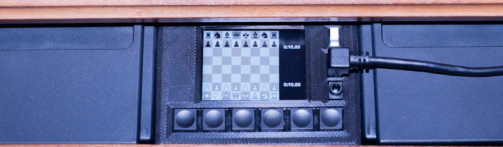
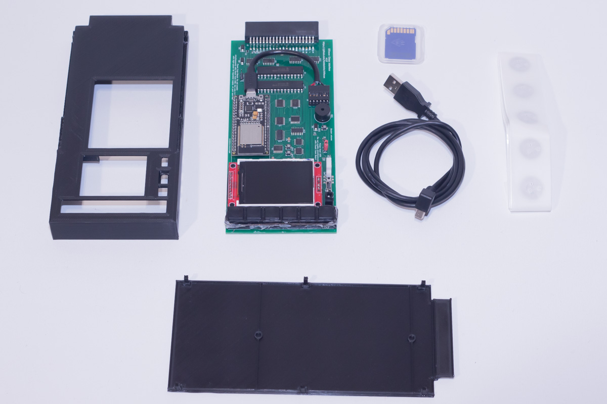
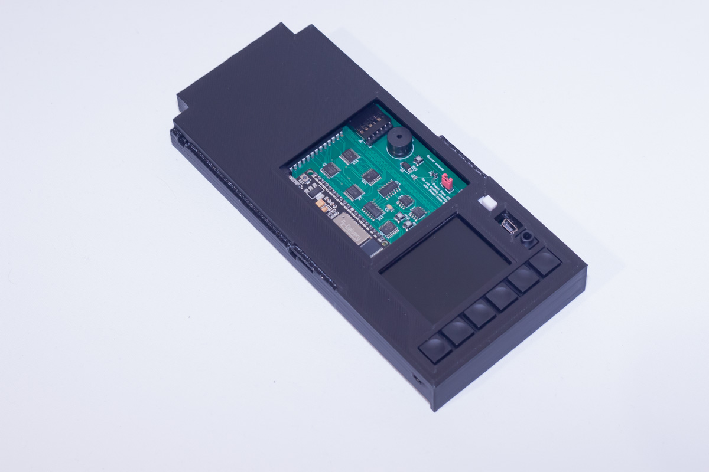
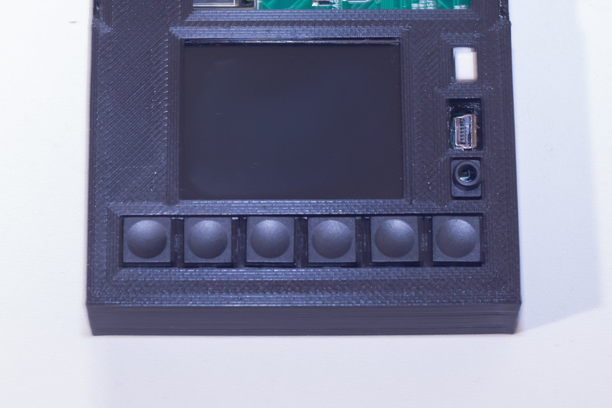
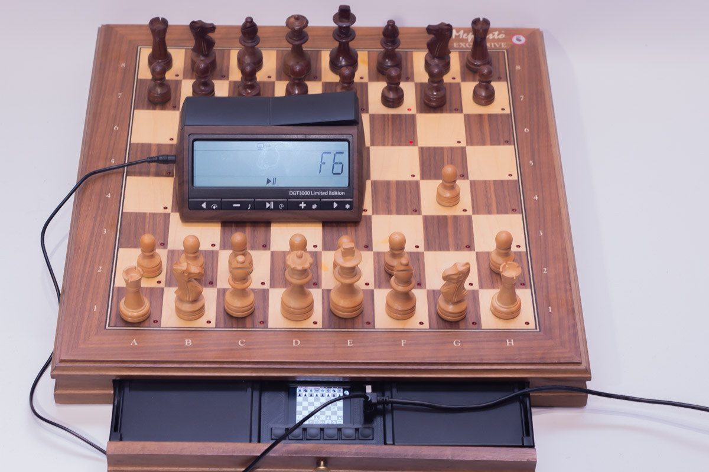

# Elfacun Chess Interface Module

## Description

Elfacun hardware is based on popular standard-of-the-shelf components. That means that it will be relatively easy for anyone to get the components to make one, and be able to fix the modules when needed in the future. The module is buit around the ESP32 microcontroller, that provides most I/O, computing and communications capabilities.

The module as initially available will be provided with the following elements:

* Elfacun chess module PCB pre-programmed and ready to use.
* 3D-printed case.
* USB to Mini-USB angled cable.
* 50 RFID tags for the chess pieces.
* SD card for software update and user configuration.

## Features

Tha main module features are:

__V2 new features:__

* V2 is compatible with all original Mephisto modules. (V1 can play alongside some original Mephisto modules)
* On the V2 module the screen brightness can be adjusted.
* V2 is designed to be more reliably powered from the board, specially alongside the Brocoli power module, so it is more suitable to get a totally wireless Mephisto board.
* On the V2 module you have access in passive mode to the dual LED mode, where you can have two Elfacun modules controlling the board leds simultaneously. Both chess apps will be able to signal its computer moves using the board leds.

__V2 and V1 features:__

* Compatible with Modular, Exclusive, München and Impos Royal boards.
* Plug and play. The module is configurable but basic operation can be performed without any configuration.
* Compatible with most DGT-compatible apps.
* Compatible with most ChessLink-compatible apps.
* USB Connectivity to chess apps.
* Bluetooth Connectivity to chess apps.
* Bluetooth Low Energy (BLE) connectivity to chess apps.
* WIFI support for direct connection to Lichess.org.
* 2.2'' 320x240 TFT color screen with board position and clock info where available.
* Compatible with the DGT-3000 clock.
* Can emulate a DGT 3000 clock (mode 25 only) with DGT-compatible apps.
* Board LEDs operation supported.
* The module can scan RFID tag equipped pieces.
* The module can track the pieces over the board without a need to scan them.
* It can take back movements without a need to scan the pieces.

Video demonstrating the module functionality:

[https://youtu.be/sNqQtBvz1Ds](https://youtu.be/sNqQtBvz1Ds)

_"DGT", "Millennium" and "Mephisto" are trademarks of their respective owners.
All the trademarks are used nominatively to indicate compatibility, and do not indicate affiliation to or endorsement by the trademark owners._
