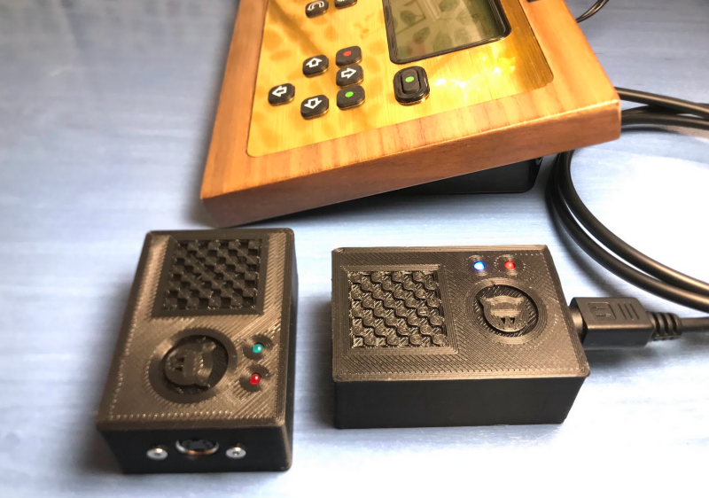
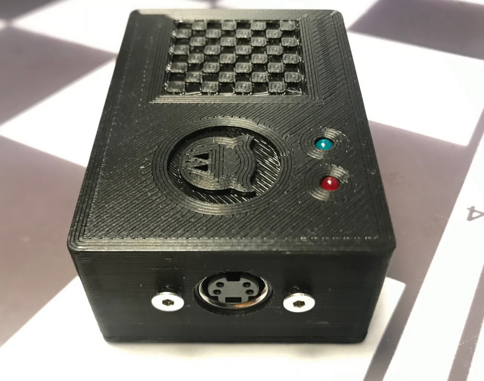

# Elfacun Chess Interface Module

## Diablillo chess bridge adapter

The Diablillo bridge adapter allows you to connect a physical Millennium chess module to Elfacun wirelessly.

## Usage

Diablillo is a zero-configuration device. To use it, just plug it to the Millennium using your original mini-DIN4 cable (the cable you would use to connect the Millennium module to a standard Millennium board). Then start your Elfacun module. The Diablillo will just connect to the module and you can start using it.

The module has two LED lights:

* The red light indicates that the adapter is powered on.
* The blue led when blinking slowly indicates that it is searching for a suitable board to connect to.
* The blue led when it is on all the time indicates that a connection with a board has been established.

If the connection to the board is lost it will automatically start looking for another board to connect to.

## Update diablillo software

The Diablillo module is updated through a Elfacun module using its SD card reader.

The update file for Diablillo will look like "remote_0xcfcfbb2f.bin" The update files will be deleted from the SD card by the module after each successful update.

To update it simply boot Elfacun in mode A with the SD card inserted containing the "remote_0xXXXXXXXX.bin" update file, and then connect the Diablillo to any Millennium module to power it on.

The diablillo will connect to Elfacun and start updating. Elfacun will be freezed during the process. While updating, the Diablillo blue LED will blink fast indicating that an update is in process. The process will take between 2 and 4 minutes. __The Diablillo shouldn't be too far away from Elfacun and try to keep the mini-DIN4 cable tightly plugged and the power on for both Elfacun and the Diablillo during the process__.

When finished one of two things may happen:

* The Diablillo reboots, starts searching for a module and connects back to Elfacun, at that point the blue LED will stay on solid. This indicates a successful update.
* The blue LED stays off and nothing happens. This indicates an update error. It can be a transmission error or that the file on the SD card is corrupted.

After a successful update you can start using the Diablillo normally.

_"DGT", "Millennium", "Mephisto", "Chessnut" and "IChessOne" are trademarks of their respective owners.
All the trademarks are used nominatively to indicate compatibility, and do not indicate affiliation to or endorsement by the trademark owners._
