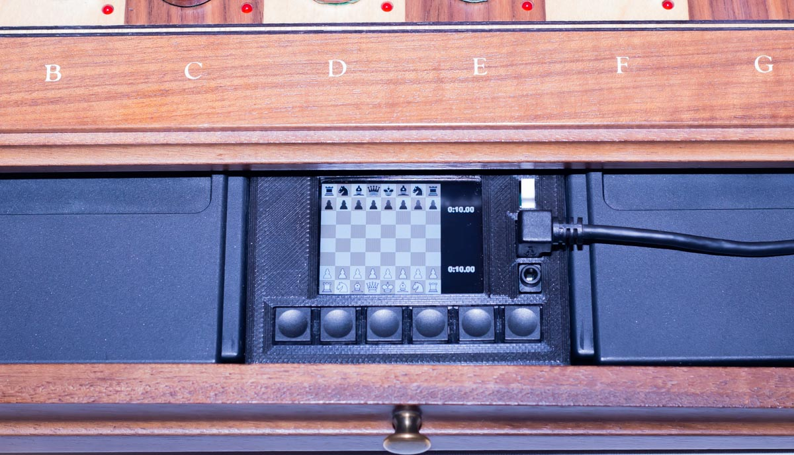
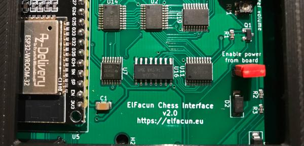
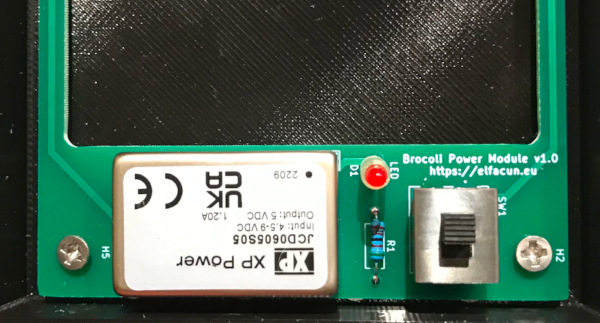

# Elfacun Chess Interface Module

## News

__(2025/06/15): Source code and design files for V2 module released: ----- [Make your own module](./SOURCE.md)__

## Elfacun chess module

This is an ongoing hardware project to create a chess module compatible with the old Mephisto modular boards (Exclusive, Modular, München) that will provide connectivity to a wide variety of chess apps and services.

The project currently comprises three devices:

* Elfacun chess module, that is the main module that enables the connectivity of modern apps to the Mephisto chess boards
* Brocoli power module, to be able to power Elfacun, the Mephisto board and some original modules from a regular USB power bank to get a true wireless chess board.
* Diablillo bridge adapter, that allows to connect wirelessly a physical Millennium chess module to Elfacun.

The hardware as well as software developed for it are published here under the GPL license.

To assist in the release of the module, I provide here links to some basic documentation:

* [V1 and V2 modules description and features](./DESCRIPTION.md)
* [Brocoli power module](./BROCOLI.md)
* [Diablillo bridge adapter](./DIABLILLO.md)
* [Compatibility chart](./COMPATIBILITY.md)
* [Limitations and remarks](./LIMITATIONS.md)
* [Operation manual](./MANUAL.md)
* [Make your own module](./SOURCE.md)

## Old News

__(2025/02/23): Elfacun software version R15 released with bug fixes:__ Link: ----- __[R15 files](https://github.com/inmbolmie/elfacun/releases/tag/R15)__ ----- Installation instructions: ----- __[Update Elfacun](./MANUAL.md#update-elfacun-software)__

__(2025/02/23): Diablillo software version R15 released with bug fixes:__ Link: ----- __[R15 files](https://github.com/inmbolmie/elfacun/releases/tag/R15)__ ----- Installation instructions: ----- __[Update Diabillo](./DIABLILLO.md#update-diablillo-software)__

__(2024/05/26): Elfacun software version R14 released with bug fixes:__ Link: ----- __[R14 files](https://github.com/inmbolmie/elfacun/releases/tag/R14)__ ----- Installation instructions: ----- __[Update Elfacun](./MANUAL.md#update-elfacun-software)__

__(2024/01/19): Elfacun software version R12 released with improvements for Lichess mode:__ Link: ----- __[R12 files](https://github.com/inmbolmie/elfacun/releases/tag/R12)__ ----- Installation instructions: ----- __[Update Elfacun](./MANUAL.md#update-elfacun-software)__

__(2023/09/16): Elfacun software version R11 released with new Chessnut-compatible mode:__ Link: ----- __[R11 files](https://github.com/inmbolmie/elfacun/releases/tag/R11)__ ----- Installation instructions: ----- __[Update Elfacun](./MANUAL.md#update-elfacun-software)__

__(2023/07/13): Elfacun software version R10 released with bug fixes:__ Link: ----- __[R10 files](https://github.com/inmbolmie/elfacun/releases/tag/R10)__ ----- Installation instructions: ----- __[Update Elfacun](./MANUAL.md#update-elfacun-software)__

__(2023/06/12): Elfacun software version R9 released with bug fixes:__ Link: ----- __[R9 files](https://github.com/inmbolmie/elfacun/releases/tag/R9)__ ----- Installation instructions: ----- __[Update Elfacun](./MANUAL.md#update-elfacun-software)__

__(2023/06/07): Elfacun software version R8 released with support for the new _Diablillo_ device:__ Link: ----- __[R8 files](https://github.com/inmbolmie/elfacun/releases/tag/R8)__ ----- Installation instructions: ----- __[Update Elfacun](./MANUAL.md#update-elfacun-software)__

__(2023/03/05): Elfacun software version R7 released with on-screen LED indications in passive mode, board position storage and customizable sound and BLE power level:__ Link: ----- __[R7 files](https://github.com/inmbolmie/elfacun/releases/tag/R7)__ ----- Installation instructions: ----- __[Update Elfacun](./MANUAL.md#update-elfacun-software)__

__(2023/02/08): Elfacun software version R6 released with opponent ELO range on Lichess challenges:__ Link: ----- __[R6 files](https://github.com/inmbolmie/elfacun/releases/tag/R6)__ ----- Installation instructions: ----- __[Update Elfacun](./MANUAL.md#update-elfacun-software)__

__(2023/01/30): Elfacun software version R5 released with some bug fixes:__ Link: ----- __[R5 files](https://github.com/inmbolmie/elfacun/releases/tag/R5)__ ----- Installation instructions: ----- __[Update Elfacun](./MANUAL.md#update-elfacun-software)__

__(2023/01/28): Elfacun hardware version 2 released with new features and improved compatibility with original modules:__ Links: ----- __[V2 features](./DESCRIPTION.md#features)__ ----- __[V2 manual](./MANUAL.md#new-v1-and-v2-features)__ ----- __[V2 compatibility](./COMPATIBILITY.md#v2-with-original-mephisto-modules)__

__(2023/01/28): Brocoli battery power module for Elfacun:__ Link: ----- __[Brocoli power module](./BROCOLI.md)__

__(2022/05/04): Elfacun software version R4 released with some bug fixes: [R4 files](https://github.com/inmbolmie/elfacun/releases/tag/R4)__ Installation instructions: ----- __[Update Elfacun](./MANUAL.md#update-elfacun-software)__

__(2022/09/03): Source code and design files released: ----- [Make your own module](./SOURCE.md)__

_"DGT", "Millennium", "Mephisto", "Chessnut" and "IChessOne" are trademarks of their respective owners.
All the trademarks are used nominatively to indicate compatibility, and do not indicate affiliation to or endorsement by the trademark owners._
