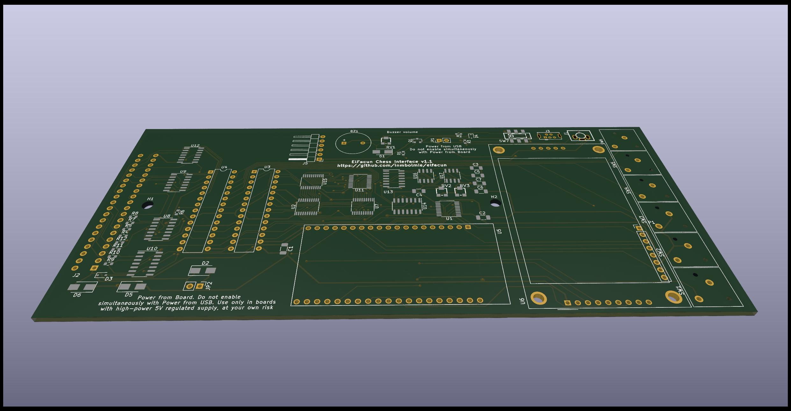
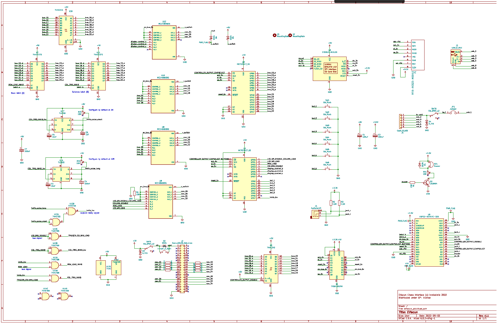
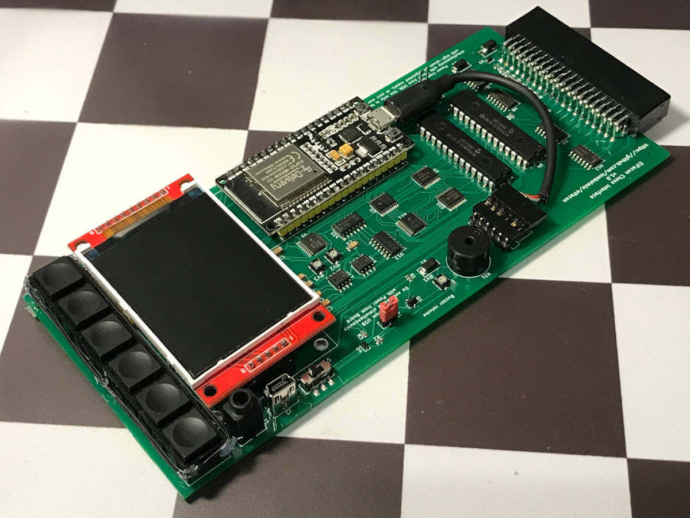

# Elfacun Chess Interface Module

## Make your own module

### Introduction

I include here all the resources needed to build a module. Building a module from scratch is not easy though. I will try to give some caveats for each step. You will need to:

* Make a PCB with the provided fabrication files, or customize one from the Kicad design files
* Get all the components and assemble the PCB
* Make a 3D-printed case
* Use the provided firmware or compile one from the Arduino source code
* Upload resources and firmware to the ESP32
* Assemble the PCB into the case

I don't recommend you to make this unless you have knowledge and equipment to debug any problem that could arise. The module is pretty hard to debug with so many SMT components. Having at hand good desoldering equipment is also recommended. The board-module connection, being deep inside the module slot is also hard to reach to be able to sample it with an oscilloscope or logic analyzer.

Anyway if you are into making this you can write me for help to the address __inmbolmie [at] gmail [dot] com__

### PCB design files

Included in the directory _Kicad_ You will need Kicad 6 to open them. I include the schematics and pcb design. [Schematics PDF](./Kicad/Elfacun_schematic_v1.1.pdf)

### PCB Fabrication files

If you want to skip the Kicad step you can use the included gerber, cpl and bom files to order the PCBs. The files are formatted for JLCPCB use but I do not endorse JLCPCB in any way. You can generate files for other fabricators from the Kicad design files though. The SMT mounting service is optional, you can order without it and assemble everything yourself.

### Components

The boards can be ordered pre-assembled and most of the components are referenced in the bom file. Availability of components come and go so sometimes some components will need to be changed.

Those are the additional components that you need not included in the BOM file. I cannot advise or endorse a particular provider for the components

* 2x MCP23S17 DIP (through hole)
* 1x AZDelivery ESP32 WROOM-32 (be aware that there are dozens of similar boards, I cannot advise about compatibility for those)
* 1x ILI9341 2.2 inch screen module
* 6x PB13 Square 12*12mm SPST momentary buttons
* 1x 40-pin 90-degree angled card edge connector (EDAC 395-040-558-212)
* 1x piezo buzzer
* 1x RFID RC522 mini module
* Approx. 1.5m of Wire-wrapping wire to make the RFID antenna
* 1x PJ-359 audio jack connector
* 1x 30cm micro-USB cable
* Angled and straight standard pin headers
* 1x Jumper

### PCB Assembly

A more detailed guide could be made in the future, but some basic steps are:

* Prepare the button assembly  gluing the buttons to the button holder
* Solder all the components except for the screen and RFID module
* Solder the wire-wrapping cable to the RFID module, removing the two central resistors and soldering each cable lead to one of the external pads
* Solder the RFID module in a way that the screen could be properly mounted
* Wrap the antenna around the buttons securing it with something like hot glue
* Solder the screen using a couple of 3D-printed screen holders to hold it at the proper height. If too high the case won't close, if too low the module will look ugly.
* Prepare the internal USB cable cutting it and attaching a 6-pin female Dupont connector with this pinout (seeing from the front of the module, from left to right):
  * Red
  * White
  * Green
  * [empty]
  * Black
  * [empty]

### 3D-printed case

I include the STL files for all the case components. The case was designed with Freecad but I won't provide the current design files as they are not properly made and it would be easier to make them from scratch that to try to modify them.

The needed parts are:

* 1x Top Case. Print (most likely) with supports
* 1x Bottom Case. Print with supports
* 6x poles to be glued to the bottom Case. Print horizontally
* 1x Button holder to raise the buttons
* 1x Switch, print horizontally
* 2x Screen holders, optional to assist in soldering the screen

The case width is critical for the module to slide properly into the board, so the printer has to be properly calibrated to get the same width or slightly less than the original modules.

### Case assembly

Be careful with the poles as the will be most likely more fragile than those in an original module

I print my cases in black PLA but it would be nice to print them in ABS.

### Software

Source code is provided in the _elfacun_ directory. I use Arduino version 1.8.18. The Arduino environment needs a ton of extra customization, I will try to complete this section in the future  with a guide to replicate it.

Needed Arduino libraries:

* ESP32 1.0.6
* BluetoothSerial version 1.0
* MCP23S17 version 1.1.3
* SPI version 1.0
* TFT_eSPI version 2.3.59
* FS version 1.0
* SPIFFS version 1.0
* WiFi version 1.0
* WiFiClientSecure version 1.0
* ArduinoJson version 6.18.5
* SD version 1.0.5
* SDConfig version 1.1
* Ethernet version 2.0.0
* BLE version 1.0.1
* MFRC522 version 1.4.8
* Update version 1.0

Before programming the board you will need to upload SPIFFS resources from the _data_ directory to the ESP32 board. You will need a 8MB ESP32 or use a custom partitioning schema with a 4MB one: __1.8MB with OTA plus 320KB SPIFFS__. The default schemas won't work.

### Additional notes

To power the module I recommend using a mini-USB angled connector to release some stress from the mini-usb connector. With a straight connector you risk ripping it accidentally from the board as it will protrude a lot. The connector has to be angled _up_ for the cable to go to the right and outside the module. A _down_ angled cable will go over the screen, and _left_ and _right_ angled cables will interfere with the on-off switch or the jack connector.
